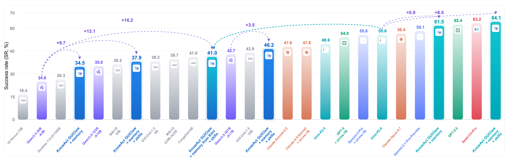
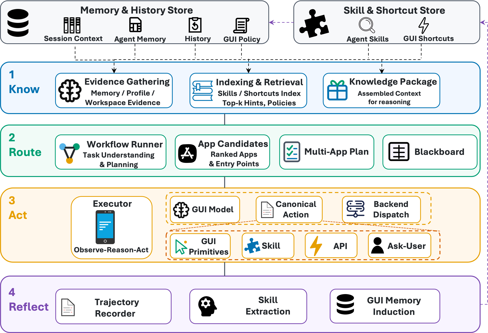
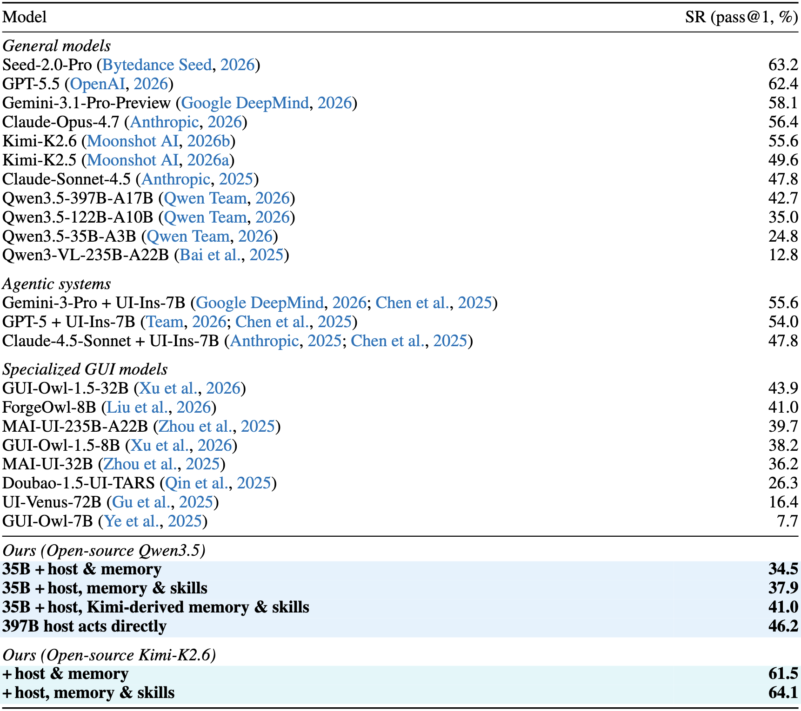

<p align="center">
  
</p>

<p align="center">
  面向桌面、Android、iOS 与 HarmonyOS 的 GUI 自动化框架。
</p>

<p align="center">
  <a href="README.md">English</a> ·
  <a href="https://arxiv.org/abs/2607.12625">论文</a> ·
  <a href="GUIClaw/docs/guiclaw-cli.md">CLI 参考</a> ·
  <a href="GUIClaw/ADAPTERS.md">适配器契约</a> ·
  <a href="https://github.com/HKUDS/nanobot">nanobot</a>
</p>

GUIClaw 运行从截图到动作的执行循环：观察当前屏幕，调用多模态模型生成
下一步动作，执行动作并检查结果。它既可以作为内置 nanobot 宿主的 GUI
子系统，也可以作为独立命令供其他智能体框架调用。

本项目基于 [HKUDS/nanobot](https://github.com/HKUDS/nanobot) 开发，保留其
MIT 许可证和第三方声明。GUIClaw 在此基础上增加了跨平台 GUI 后端、模型动作
Profile、可复用技能与记忆、Shortcut 验证，以及精简的运行记录。

论文：[KnowAct-GUIClaw: Know Deeply, Act Perfectly, Personal GUI Assistant
with Self-Evolving Memory and Skill](https://arxiv.org/abs/2607.12625)。



> [!IMPORTANT]
> GUI 自动化能够点击、输入、启动应用并改变设备状态。请先使用 `--dry-run`
> 检查配置；涉及验证或敏感数据时，优先使用测试设备和测试账号。

## 架构

GUIClaw 通过 Know–Route–Act–Reflect 循环组织个人 GUI 助手的执行流程。



## 选择安装方式

| 使用场景 | 安装方式 | 入口 |
| --- | --- | --- |
| 完整智能体宿主 | 安装仓库环境。代码中已经接好 nanobot adapter。 | `nanobot webui`、`nanobot gateway`、`nanobot agent` |
| 独立 GUI 工具 | 使用 uv tool 安装本地项目，由终端、脚本、Hermes、OpenClaw 或其他宿主调用。 | `guiclaw` |

当前 Python distribution 名称仍为 `nanobot-ai`，其中同时包含两个包。
独立模式仅在运行时使用 `guiclaw` 命令；`guiclaw` 包本身不会导入
`nanobot`。

## 快速开始：完整宿主

前置要求：Python 3.11+、[uv](https://docs.astral.sh/uv/)、一个多模态模型，
以及目标后端所需的平台工具。

```bash
git clone https://github.com/HITsz-TMG/KnowAct.git
cd KnowAct/GUIClaw
uv sync --extra web --extra desktop --extra cjk
uv run nanobot onboard --wizard
```

在 `~/.nanobot/config.json` 中加入 `gui` 配置。provider 也需要在 nanobot
配置中注册。

```json
{
  "providers": {
    "custom": {
      "apiKey": "your-api-key",
      "apiBase": "https://api.example.com/v1"
    }
  },
  "gui": {
    "backend": "adb",
    "provider": "custom",
    "model": "your-vision-model",
    "agentProfile": "default",
    "maxSteps": 15,
    "enablePlanner": true,
    "enableRouter": true,
    "enableSkillExecution": true,
    "enablePromptSkillSelection": true,
    "promptSkillTopK": 5,
    "promptShortcutOnly": false,
    "promptSkillAppFilter": false
  }
}
```

启动 WebUI：

```bash
uv run nanobot webui
```

宿主将 GUIClaw 注册为 `gui_task`。屏幕操作由 GUIClaw 执行，文件、Shell、
Web、MCP、记忆等工具仍由 nanobot 管理。

## 快速开始：独立 CLI

克隆仓库后，在仓库根目录安装命令：

```bash
git clone https://github.com/HITsz-TMG/KnowAct.git
cd KnowAct

# Android、HarmonyOS 或 dry-run
uv tool install ./GUIClaw

# 本地桌面自动化改用以下命令
# uv tool install './GUIClaw[desktop]'
```

创建 `~/.guiclaw/config.yaml`：

```yaml
provider:
  base_url: "https://api.example.com/v1"
  model: "your-vision-model"

max_steps: 15
stagnation_limit: 0
image_scale_ratio: 0.5
agent_profile: default
```

设置 API Key 并运行 smoke test：

```bash
export OPENAI_API_KEY="your-api-key"

guiclaw --dry-run "描述当前屏幕并结束任务"
guiclaw --backend adb "打开设置并开启 Wi-Fi"
```

供其他智能体或脚本调用时，建议输出 JSON：

```bash
guiclaw --backend adb --json --task "打开联系人并搜索 John"
```

[CLI 与配置参考](GUIClaw/docs/guiclaw-cli.md)包含安装 extras、全部命令参数、
完整默认值、后端准备、Shortcut 验证以及 subprocess 接入示例。

## 可用命令

| 命令 | 说明 |
| --- | --- |
| `guiclaw TASK` | 使用默认本地后端执行一个 GUI 任务。 |
| `guiclaw --backend adb TASK` | 在 Android 设备或模拟器上执行任务。 |
| `guiclaw --backend ios TASK` | 通过 WebDriverAgent 操作 iOS。 |
| `guiclaw --backend hdc TASK` | 在 HarmonyOS 设备上执行任务。 |
| `guiclaw --backend local TASK` | 执行前台桌面自动化。 |
| `guiclaw --dry-run TASK` | 不改变真实设备，检查模型和 Agent 循环。 |
| `guiclaw shortcuts SOURCE` | 从 Manifest 文件或目录静态推导 Android Shortcut。 |
| `guiclaw shortcuts CACHE.json --validate` | 在 ADB 设备上验证 Shortcut 候选。 |
| `guiclaw shortcuts CACHE.json --validate --promote` | 将符合条件的验证结果写入公共技能文件。 |
| `guiclaw --help` | 查看任务命令选项。 |
| `guiclaw shortcuts --help` | 查看 Shortcut 命令选项。 |

## 配置与默认目录

GUIClaw 的运行数据与 nanobot workspace 分离：

| 路径 | 用途 |
| --- | --- |
| `~/.guiclaw/config.yaml` | 独立 CLI 配置。 |
| `~/.guiclaw/gui_runs/` | 截图、精简轨迹与任务结果。 |
| `~/.guiclaw/shortcut_cache/` | 静态推导的 Android Shortcut。 |
| `~/.guiclaw/shortcut_cache_validation/` | Shortcut 运行时验证记录。 |
| `~/.guiclaw/skill/skills.py` | 前部为验证后的 Shortcut，后部为提取技能。 |
| `~/.guiclaw/memory/policy.md` | 始终注入的 `POLICY` memory，以及默认的保守权限 setup。 |
| `~/.guiclaw/memory/gui_memory_bank.jsonl` | 提取的 GUI 记忆。 |

如果尚无 `POLICY` 条目，首次 GUI 任务会初始化一条保守权限策略：除非任务明确授权，
否则拒绝、取消或暂缓权限申请。用户可以编辑 `policy.md` 中的结构化条目。该策略只用于
引导模型，不能保证强制执行；必须遵守的限制仍需通过系统权限、backend、宿主确认或
沙箱实现。

常用默认值：

| 设置 | 独立 CLI | nanobot adapter |
| --- | --- | --- |
| Backend | `local` | `adb` |
| Agent Profile | `default` | 未配置时为 `default` |
| 最大步数 | `15` | `15` |
| 图像缩放比例 | `0.5` | `0.5` |
| Planner / Router | 不使用 | 默认启用 |
| Prompt Skill 选择 | standalone YAML 暂未暴露 | 默认关闭 |
| 技能与记忆提取 | standalone YAML 暂未暴露 | 默认关闭 |

完整 standalone 与 adapter 字段表见
[GUIClaw CLI 与配置参考](GUIClaw/docs/guiclaw-cli.md)。

## Android Shortcut 验证

静态推导会为每个 package 生成一个 cache。随后可以在 ADB 设备上启动候选，
并在提升前选择使用视觉模型验证：

```bash
export DASHSCOPE_API_KEY="你的 API Key"

guiclaw shortcuts ~/.guiclaw/shortcut_cache/com.example.app.json \
  --validate \
  --promote \
  --llm-base-url https://dashscope.aliyuncs.com/compatible-mode/v1 \
  --llm-model qwen3.5-flash \
  --llm-api-key-env DASHSCOPE_API_KEY
```

符合条件的记录会写入 `~/.guiclaw/skill/skills.py`。验证过程会启动 intent，
可能改变应用状态，建议使用测试设备。

## 支持后端

| Backend | 平台 | 要求 |
| --- | --- | --- |
| `local` | macOS、Linux、Windows | 安装 `desktop` extra；macOS 需授予辅助功能与屏幕录制权限。 |
| `adb` | Android | 连接 ADB 设备或模拟器。 |
| `ios` | iOS | 安装 `ios` extra，并运行已签名的 WebDriverAgent。 |
| `hdc` | HarmonyOS | 连接 HDC 设备，并启动所需的 UI 测试服务。 |
| `dry-run` | 测试与 CI | 不改变真实设备，但仍会调用配置的模型。 |

Linux 后台任务使用 Xvfb；Windows 在目标应用受支持时可以使用隔离桌面；
macOS 目前只支持前台桌面自动化。

## Agent Profile

CLI 支持：

`default`、`general_e2e`、`gui_owl`、`venus`、`seed`、`qwen3vl`、
`mai_ui` 和 `gelab`。

支持可靠原生 function calling 的模型优先使用 `default`。其他 Profile
对应各 GUI 模型家族要求的动作输出格式。

## 实验结果

论文中报告的 Pass@1 成功率如下：



## 目录结构

```text
KnowAct/
├── README.md
├── README_CN.md
└── GUIClaw/
    ├── guiclaw/       # 宿主无关的 GUI 运行时
    ├── nanobot/       # 内置智能体宿主与 GUI adapter
    ├── webui/         # 浏览器工作台
    ├── tests/         # Python 测试
    ├── docs/          # CLI、nanobot 与开发文档
    └── pyproject.toml # nanobot 与 guiclaw 命令入口
```

## 开发与测试

```bash
cd GUIClaw
uv sync --extra dev --extra desktop --extra cjk
uv run pytest
uv run ruff check nanobot guiclaw tests
```

WebUI 开发还需要 Bun：

```bash
cd GUIClaw/webui
bun install
bun run test
bun run build
```

## 文档

- [GUIClaw 框架概览](GUIClaw/README.md)
- [CLI 与配置参考](GUIClaw/docs/guiclaw-cli.md)
- [适配器模式](GUIClaw/ADAPTERS.md)
- [nanobot 文档](https://github.com/HKUDS/nanobot/tree/main/docs)
- [参与贡献](https://github.com/HKUDS/nanobot/blob/main/CONTRIBUTING.md)
- [安全策略](https://github.com/HKUDS/nanobot/blob/main/SECURITY.md)
- [许可证](https://github.com/HKUDS/nanobot/blob/main/LICENSE)
- [第三方声明](https://github.com/HKUDS/nanobot/blob/main/THIRD_PARTY_NOTICES.md)

## 引用

如果 KnowAct-GUIClaw 对你的研究有帮助，请引用：

```bibtex
@misc{li2026knowactguiclawknowdeeplyact,
  title        = {KnowAct-GUIClaw: Know Deeply, Act Perfectly, Personal GUI Assistant with Self-Evolving Memory and Skill},
  author       = {Yunxin Li and Jinchao Li and Shibo Su and Zhenran Xu and Chenrui Zhao and Tongshu Bian and Xiaoman Liang and Meishan Zhang and Baotian Hu and Min Zhang},
  year         = {2026},
  eprint       = {2607.12625},
  archivePrefix = {arXiv},
  primaryClass = {cs.CL},
  url          = {https://arxiv.org/abs/2607.12625}
}
```

## 致谢

GUIClaw 基于并参考了以下开源与研究项目：

- [HKUDS/nanobot](https://github.com/HKUDS/nanobot) 提供了当前发行版使用的
  轻量级智能体宿主，以及 Provider、Channel、Tool 和配置基础。
- [Tongyi-MAI/MobileWorld](https://github.com/Tongyi-MAI/MobileWorld/tree/main#-benchmark-statistics)
  为移动端 GUI Agent Profile、动作约定和面向 Benchmark 的工作流提供了参考。
- [stepfun-ai/gelab-zero](https://github.com/stepfun-ai/gelab-zero) 为 GELab
  模型接入和移动端 GUI Agent 的工程实践提供了参考。
- [google-research/reasoning-bank](https://github.com/google-research/reasoning-bank)
  启发了基于 GUI 轨迹提取经验并沉淀可复用记忆的设计。

感谢上述项目的作者与贡献者向社区开放工作成果。各项目仍分别受其自身许可证与归属
要求约束；具体条款请查看对应仓库及 nanobot 的
[第三方声明](https://github.com/HKUDS/nanobot/blob/main/THIRD_PARTY_NOTICES.md)。
此处列出项目仅用于说明技术影响或已记录的复用关系，不表示官方隶属、合作或背书。

## 许可证与归属

GUIClaw 使用 MIT License 发布。仓库保留 nanobot 原始
[LICENSE](https://github.com/HKUDS/nanobot/blob/main/LICENSE)与
[THIRD_PARTY_NOTICES.md](https://github.com/HKUDS/nanobot/blob/main/THIRD_PARTY_NOTICES.md)，
并在 [NOTICE](GUIClaw/NOTICE) 中记录补充归属。GUIClaw 是独立项目，并非
HKUDS/nanobot 官方发行版。
